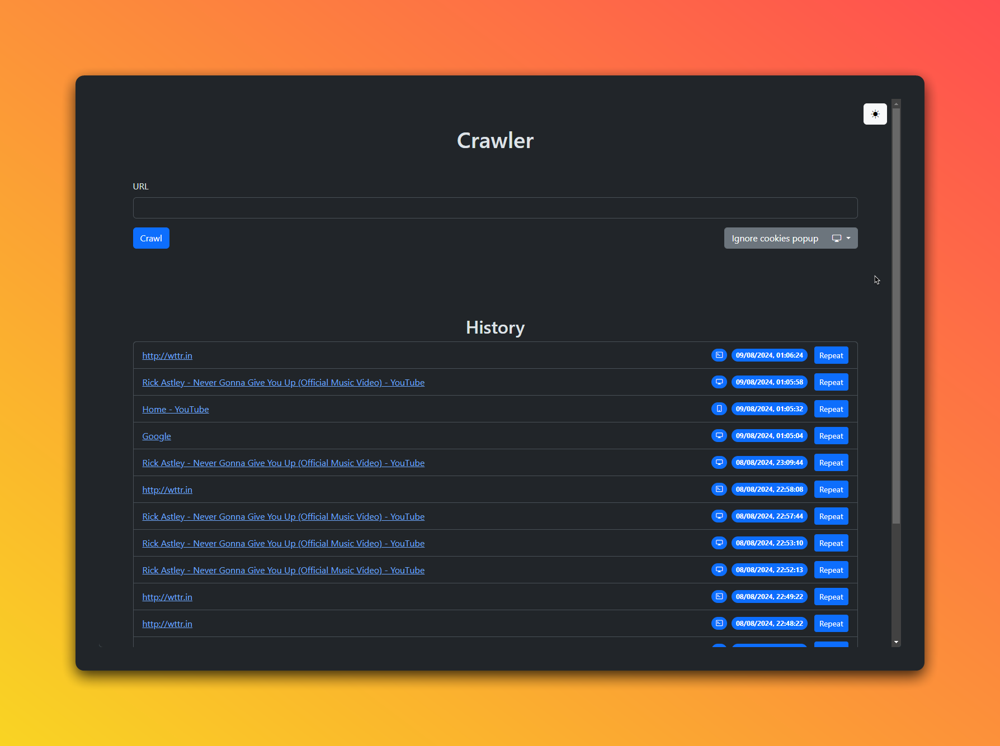

# [crawler](https://github.com/EXELVI/crawler)

A simple crawler that makes ten screenshots every 500ms of the given URL.



## Installation

To install the project, you need to have [Node.js](https://nodejs.org/) installed on your machine.

1. Clone the repository to your local machine:

    ```bash
    git clone https://github.com/EXELVI/crawler.git
    ```

2. Install the dependencies:

    ```bash
    npm install
    ```

3. Install ISDCAC (I still don't care about cookies):

    Direct download (Chrome): [ISDCAC-chrome-source.zip](https://github.com/OhMyGuus/I-Still-Dont-Care-About-Cookies/releases/download/v1.1.4/ISDCAC-chrome-source.zip)

    Github Release Page: [I-Still-Dont-Care-About-Cookies](https://github.com/OhMyGuus/I-Still-Dont-Care-About-Cookies/releases)

## Usage

1. Run the project:

    ```bash
    npm start
    ```

2. Open the browser and go to the URL: [http://localhost:3000](http://localhost:3000)

3. Enter the URL you want to crawl and click the "Start" button.

## Features

- Take screenshots of the given URL.
- History of the crawled URLs.
- Change device type (desktop, mobile, terminal).
- Choose to ignore cookies popups.

## Contributing

Contributions are welcome! If you find any issues or have suggestions for improvements, please open an issue or submit a pull request on the GitHub repository.
